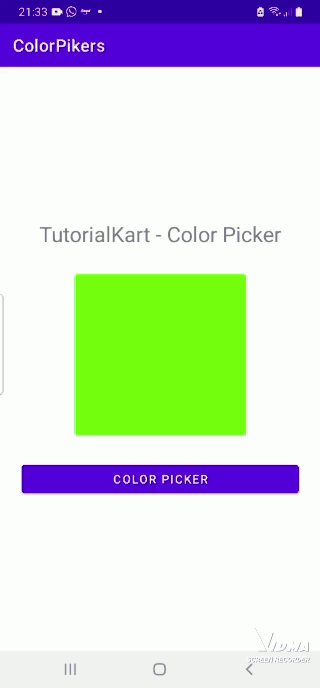

# Aplicativo Android - Color Picker

 

Aplicativo Android para selecionar cores


## Primeiros Passos

Siga estas instruções para ter uma cópia do projeto funcionando em seu computador.

> Caso não esteja interessado no desenvolvimento, vá para a página [Releases]() e baixe o compilado para executar.

### Pré-requisitos

O que você precisará:

```
IDE Android Studio
Android SDK
JDK
Gradle
```

### Instalando

Siga os passos a seguir para rodar esta aplicação em seu computador.

#### Variáveis de ambiente

Informe ao Android Studio o caminho da sua SDK

```
No Windows, vá em Painel de Controle → Sistema e Segurança → Sistema → Configurações avançadas do sistema → Variáveis de Ambiente → Novo
```

Insira a variável de ambiente abaixo:

```
ANDROID_HOME = <<diretório_do_android_sdk>>
```

> Você pode ignorar esta etapa se preferir criar um arquivo local.properties dentro do diretório do projeto para especificar o valor de 'sdk.dir'

#### Obtendo uma cópia

Faça o download, use uma ferramente Git ou a própria IDE Android Studio para clonar este repositório:

```
Na tela de boas vintas do Android Studio, vá em Check out project from Version Control → Git
Informe a URI e clique em Clone, na pergunta sobre criar um projeto do Android Studio, clique em Yes
Marque Create project from existing sources e clique em Next/Yes até finalizar, mantenha as opções padrão
```

### Executando

Execute o projeto:

```
No Android Studio, clique em Run → Run 'app'
```

> A primeira execução irá demorar, pois a IDE irá montar e instalar o APK no dispositivo.


## Deployment

Distribua este projeto como um arquivo *.apk para instalar em um dispositivo Android ou enviar para a Play Store:

```
No Android Studio, com o botão direito sobre o projeto, vá em Build → Build Bundle(s) / APK(s) → Build APK(s)
```

## Tecnologias utilizadas

* [Kotlin](https://kotlinlang.org/) 
* [Android Studio](https://developer.android.com/studio) 
* [Gradle](https://gradle.org/) 
* [XML](https://fontawesome.com/) 

